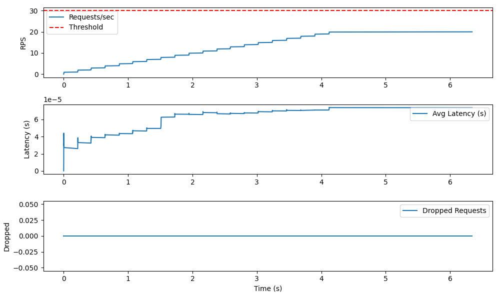

# DDoS Simulator - README


## License
This project is licensed under the MIT License. See the LICENSE file for details.

## Description
This project simulates a DDoS-like scenario for educational purposes only. It is strictly limited to localhost or private environments and does not allow targeting external IPs or domains.

## How it works
- A simple HTTP server is started on localhost.
- Multiple simulated clients send requests concurrently using asyncio.
- Each client is rate-limited and the total traffic is configurable.
- The server tracks metrics: requests per second, average latency, and dropped requests.
- If the request rate exceeds a threshold, the server starts dropping requests (HTTP 429).
- All activity is logged.

## Educational Purpose
This simulation demonstrates how a server can be overwhelmed by a high volume of requests, similar to a real DDoS attack. It is designed for safe, local experimentation and learning about:
- Concurrency and rate limiting
- Server-side detection of excessive traffic
- Basic metrics collection and logging

**This project is NOT a real attack tool and must never be used against public or unauthorized systems.**

## Requirements
- Python 3.8+
- aiohttp

## Installation
```
pip install aiohttp
```

## Usage
```
python simulator/ddos_simulator.py
```

## Configuration
Edit the variables at the top of `simulator/ddos_simulator.py` to change the number of clients, rate limits, and thresholds.


## Example Output
Below is an example graph generated by the simulator:



## Metrics
Visit [http://127.0.0.1:8080/metrics](http://127.0.0.1:8080/metrics) while the simulation is running to see live metrics.

## Disclaimer
This code is for educational use only. Do not use it to target any external, public, or unauthorized systems. The authors are not responsible for misuse.
