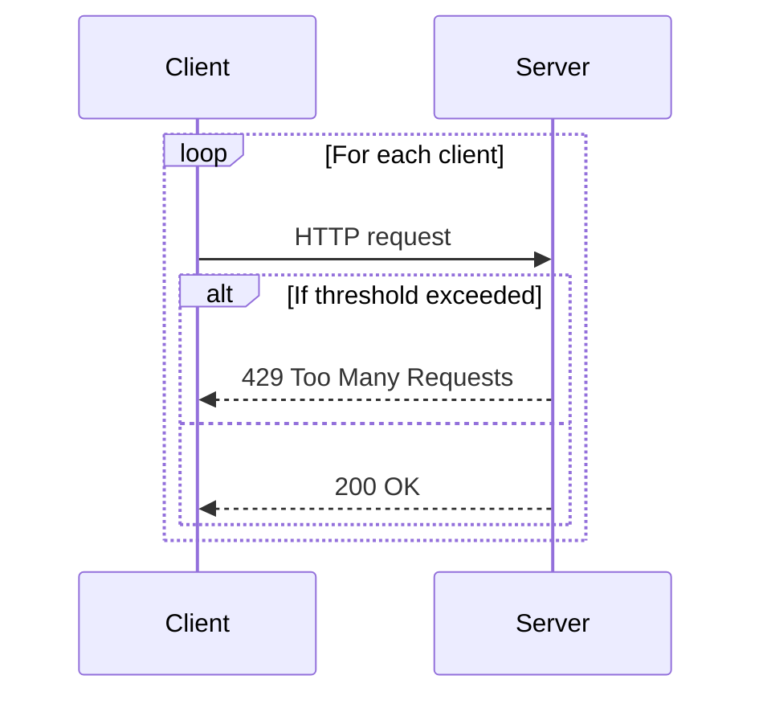

# DDoS Simulator - Sequence Diagram

```mermaid
sequenceDiagram
    participant Client
    participant Server
    loop For each client
        Client->>Server: HTTP request
        alt If threshold exceeded
            Server-->>Client: 429 Too Many Requests
        else
            Server-->>Client: 200 OK
        end
    end
```
